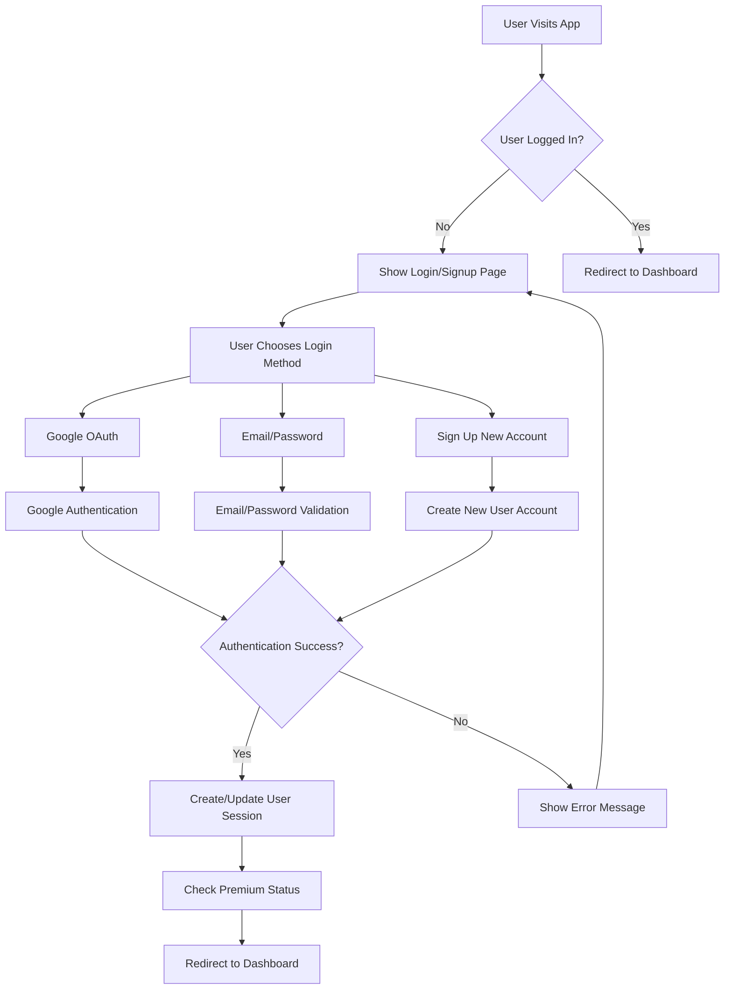
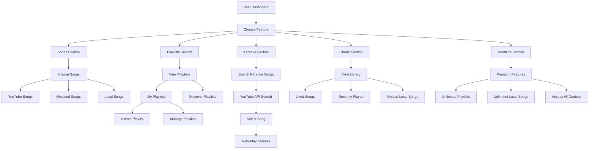
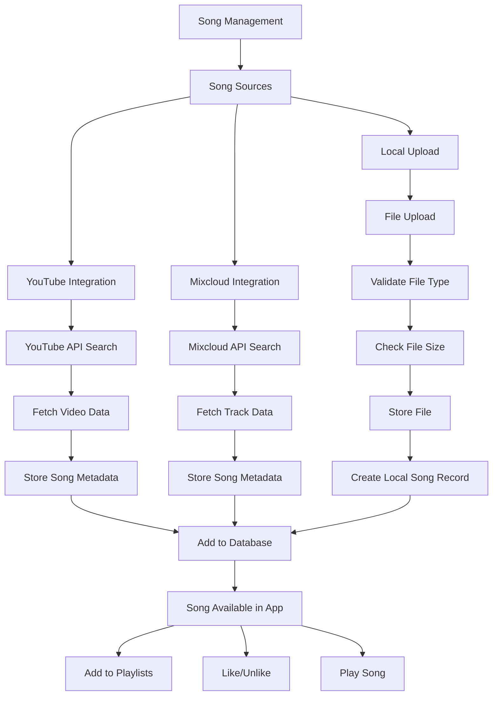
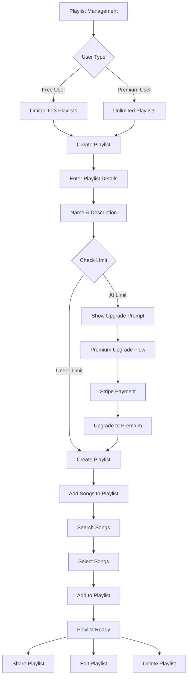
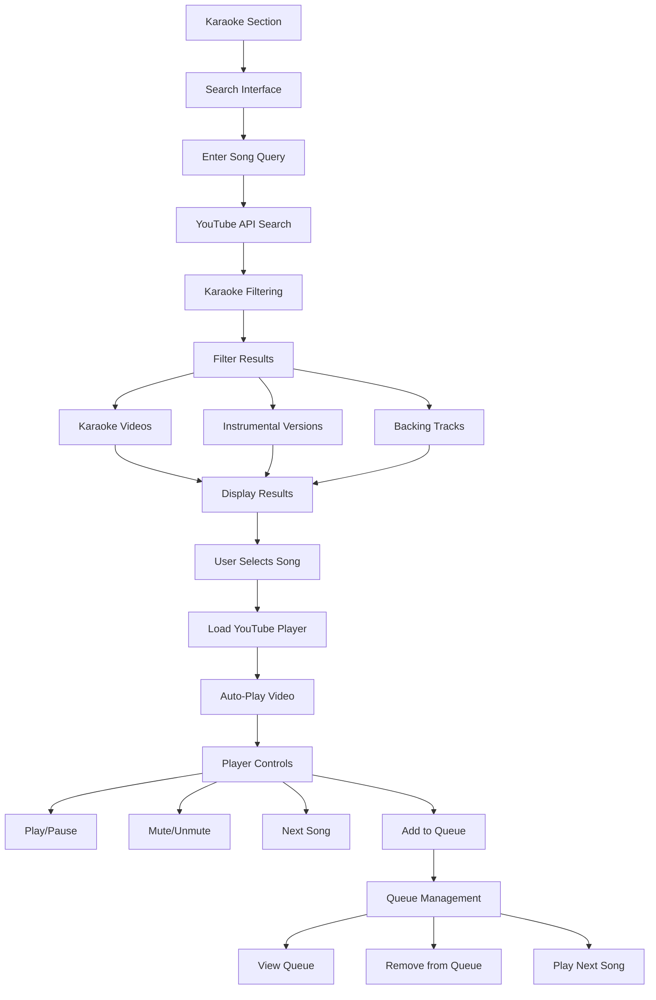
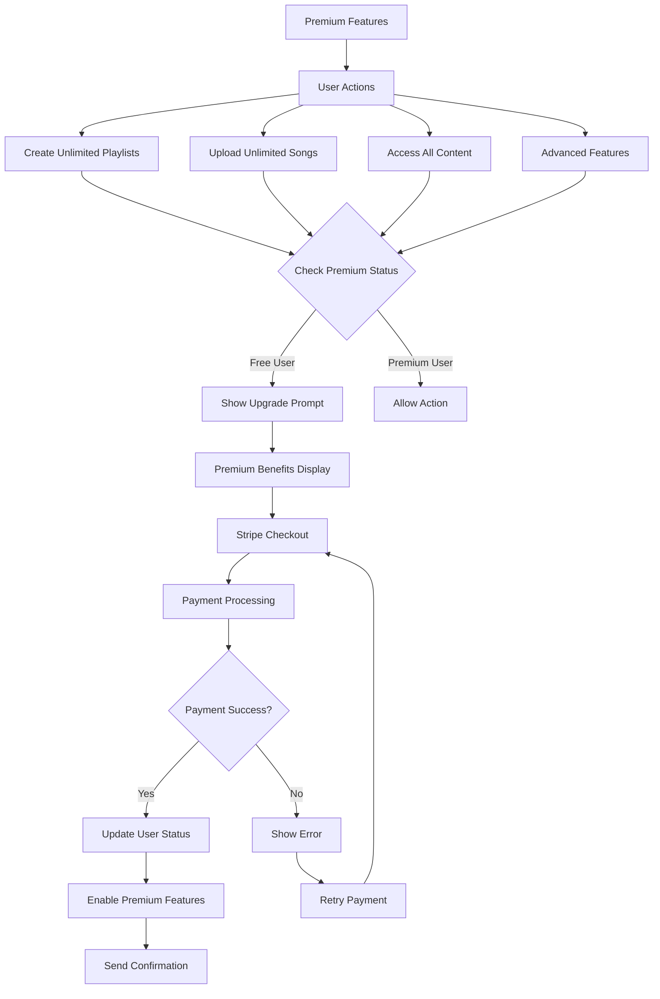
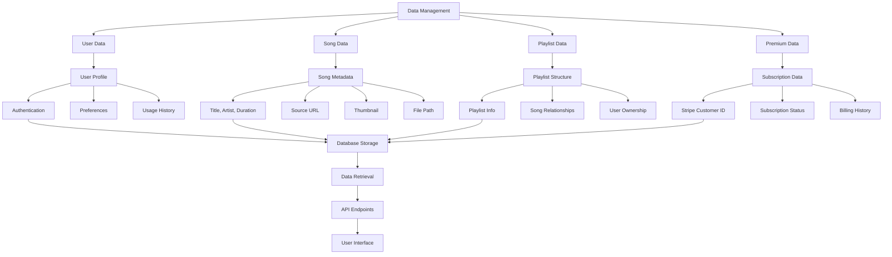
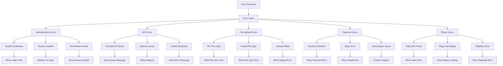
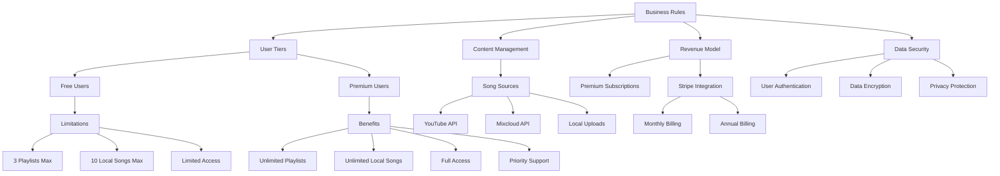
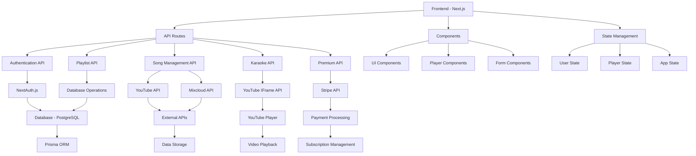

# Music Karaoke Web - User Flow & Business Process Flowcharts

## 1. User Authentication Flow

## 2. Core User Journey Flow

## 3. Song Management Flow

## 4. Playlist Management Flow

## 5. Karaoke Experience Flow

## 6. Premium Subscription Flow

## 7. Data Management Flow

## 8. Error Handling Flow

## 9. Business Logic Flow

## 10. Technical Architecture Flow

## Key Business Processes:

### 1. **User Onboarding**
- Registration/Authentication
- Feature introduction
- Premium upgrade prompts

### 2. **Content Discovery**
- Multi-source song search
- Playlist creation and sharing
- Karaoke song discovery

### 3. **Premium Conversion**
- Feature limitation triggers
- Upgrade prompts
- Payment processing

### 4. **Content Management**
- Song metadata management
- Playlist organization
- User-generated content

### 5. **Revenue Generation**
- Subscription management
- Payment processing
- Premium feature access

### 6. **User Engagement**
- Playlist creation
- Song liking/favoriting
- Social sharing features

This comprehensive flow chart system covers all major user journeys and business processes in your Music Karaoke Web application! 